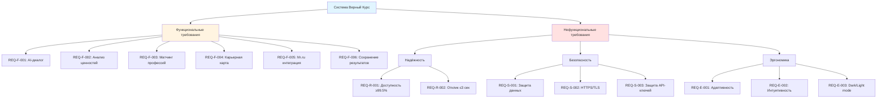
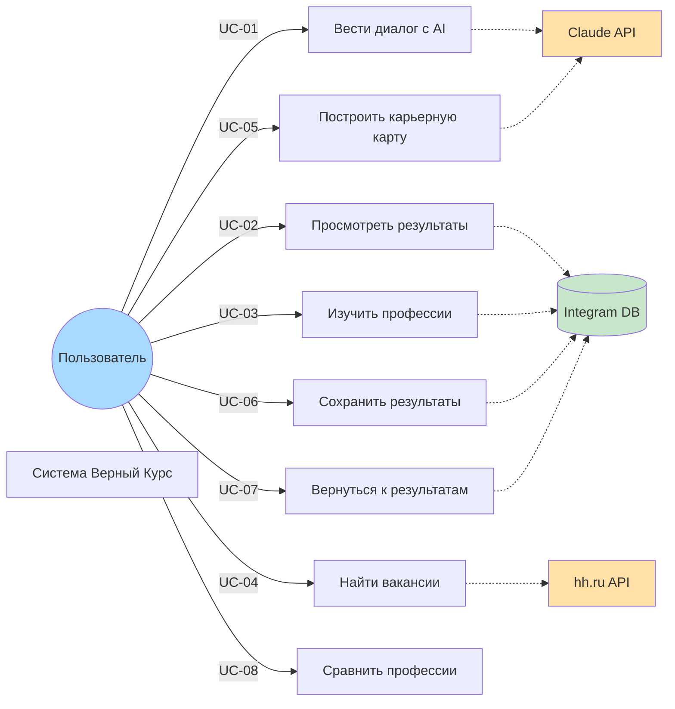
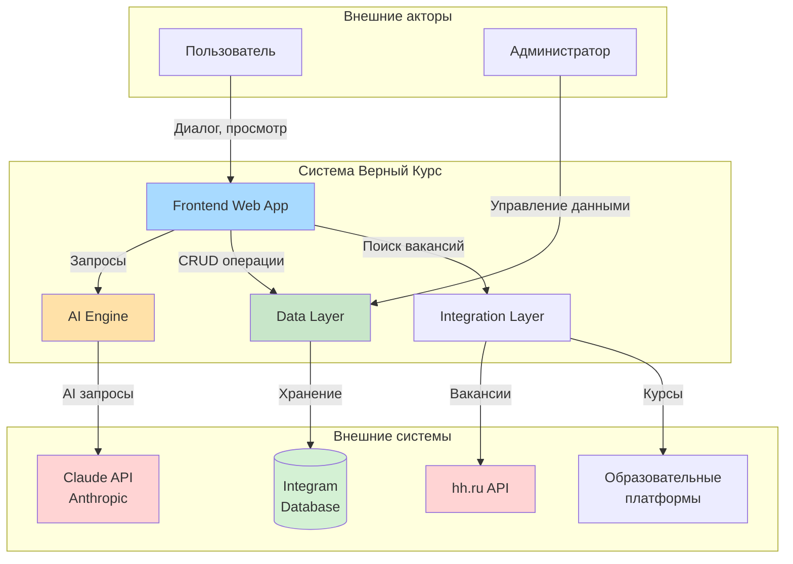
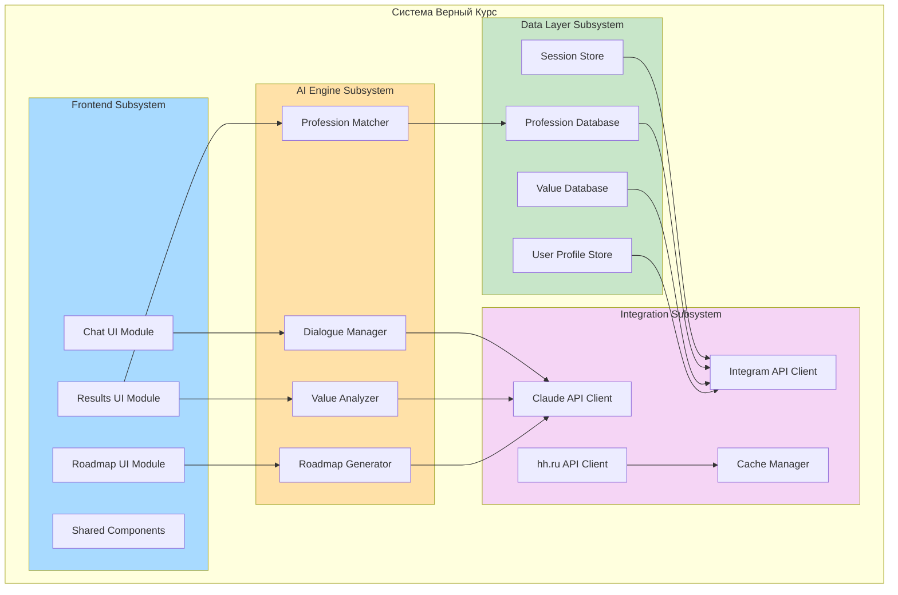
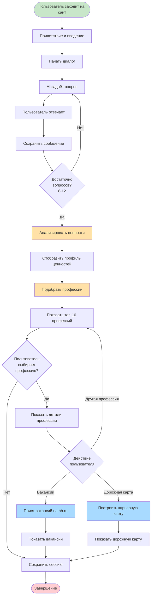
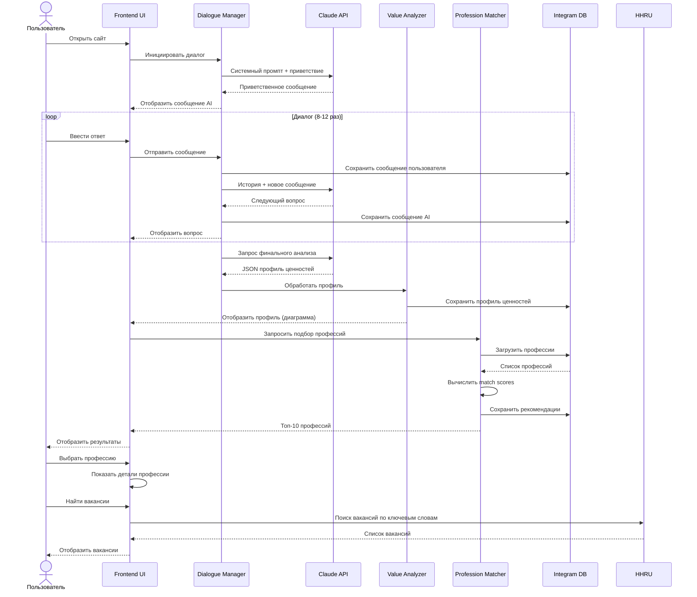
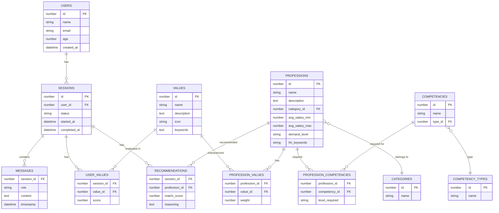
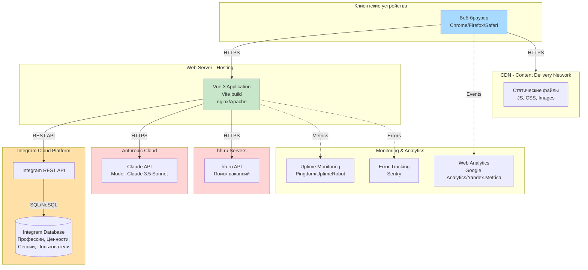

# ТЕХНИЧЕСКОЕ ЗАДАНИЕ
# на систему «Верный Курс» — AI-помощник профориентации

**Согласно ГОСТ 34.602-89**
**С применением подхода Model-Based Systems Engineering (MBSE)**

---

## СОДЕРЖАНИЕ

1. [Общие сведения](#1-общие-сведения)
2. [Назначение и цели создания системы](#2-назначение-и-цели-создания-системы)
3. [Характеристика объекта автоматизации](#3-характеристика-объекта-автоматизации)
4. [Требования к системе](#4-требования-к-системе)
   - 4.1 [Функциональные требования](#41-функциональные-требования)
   - 4.2 [Требования к надёжности](#42-требования-к-надёжности)
   - 4.3 [Требования к безопасности](#43-требования-к-безопасности)
   - 4.4 [Требования к эргономике](#44-требования-к-эргономике)
   - 4.5 [Требования к видам обеспечения](#45-требования-к-видам-обеспечения)
5. [Состав и содержание работ](#5-состав-и-содержание-работ)
6. [Порядок контроля и приёмки](#6-порядок-контроля-и-приёмки)
7. [Требования к документированию](#7-требования-к-документированию)
8. [Источники разработки](#8-источники-разработки)
9. [MBSE артефакты](#9-mbse-артефакты)
10. [Матрица трассируемости требований](#10-матрица-трассируемости-требований)

---

## 1. ОБЩИЕ СВЕДЕНИЯ

### 1.1 Наименование системы

**Полное наименование:** Автоматизированная система профориентации «Верный Курс»
**Сокращённое наименование:** АС «Верный Курс»
**Английское наименование:** True Course AI Career Guidance System

### 1.2 Заказчик

**Наименование:** Проект поддержки профориентации молодёжи
**Сфера деятельности:** Образование, профессиональная ориентация
**Контактное лицо:** unidel2035
**Репозиторий проекта:** https://github.com/unidel2035/vkurs

### 1.3 Разработчик

**Наименование:** Команда разработки «Верный Курс»
**Репозиторий:** https://github.com/unidel2035/vkurs
**Технологический стек:**
- Frontend: Vue 3, TypeScript, PrimeVue
- Backend: Integram (low-code платформа)
- AI Engine: Claude API (Anthropic)
- Интеграции: hh.ru API

### 1.4 Основания для разработки

- Необходимость в современных инструментах профориентации для молодёжи
- Растущая потребность в персонализированном подходе к выбору карьеры
- Возможность применения AI для глубокого анализа ценностного профиля человека
- Недостаток инструментов, учитывающих личные ценности при выборе профессии

### 1.5 Сроки выполнения работ

| Фаза | Содержание | Планируемые сроки |
|------|------------|-------------------|
| Фаза 0 | Техническое задание (MBSE) | Текущая |
| Фаза 1 | Фундамент (архитектура, данные, базовый UI) | 2 недели |
| Фаза 2 | AI-ядро (Claude, промпты, алгоритм матчинга) | 2 недели |
| Фаза 3 | MVP (чат-интерфейс, результаты, интеграции) | 3 недели |
| Фаза 4 | Расширение (авторизация, PWA, аналитика) | 3 недели |

**Общая длительность разработки MVP:** 10 недель

### 1.6 Плановые сроки ввода в действие

**MVP версия:** После завершения Фазы 3
**Полнофункциональная версия:** После завершения Фазы 4

---

## 2. НАЗНАЧЕНИЕ И ЦЕЛИ СОЗДАНИЯ СИСТЕМЫ

### 2.1 Назначение системы

Автоматизированная система «Верный Курс» предназначена для:

1. **Профориентации молодых людей** на основе ценностного подхода
2. **Выявления личностного профиля** через AI-диалог с использованием Claude
3. **Подбора профессий**, максимально соответствующих внутренним ценностям пользователя
4. **Построения карьерной дорожной карты** с учётом текущих навыков и желаемой профессии
5. **Поиска актуальных вакансий** через интеграцию с hh.ru
6. **Рекомендаций по обучению** для достижения карьерных целей

### 2.2 Целевая аудитория

| Категория | Возраст | Потребности |
|-----------|---------|-------------|
| **Школьники старших классов** | 15-18 лет | Первичный выбор профессии, подготовка к ЕГЭ |
| **Студенты вузов и колледжей** | 18-23 года | Корректировка выбора, планирование карьеры |
| **Молодые специалисты** | 23-30 лет | Смена профессии, карьерный рост |
| **Люди в поиске себя** | Любой возраст | Профессиональная переориентация |

### 2.3 Цели создания системы

#### Бизнес-цели

1. **Повышение качества профориентации** через персонализированный подход
2. **Снижение количества неудачных карьерных выборов** на 30%
3. **Увеличение удовлетворённости пользователей** от рекомендаций (>4/5)
4. **Создание масштабируемого решения** для широкой аудитории

#### Технические цели

1. **Внедрение AI-технологий** в процесс профориентации
2. **Автоматизация анализа ценностного профиля** пользователя
3. **Интеграция с внешними сервисами** (hh.ru, образовательные платформы)
4. **Построение гибкой архитектуры** для развития функционала

### 2.4 Критерии эффективности (MOE - Measures of Effectiveness)

| ID | Критерий | Целевое значение | Метод измерения |
|----|----------|------------------|-----------------|
| **MOE-01** | Completion rate диалога | ≥ 70% | Процент завершённых сессий |
| **MOE-02** | Среднее время сессии | 10-15 минут | Метрика в аналитике |
| **MOE-03** | Удовлетворённость рекомендациями | ≥ 4.0/5.0 | Опрос после сессии |
| **MOE-04** | Переход к изучению вакансий | ≥ 50% | Процент кликов на вакансии |
| **MOE-05** | Возврат пользователей | ≥ 30% | Повторные визиты за месяц |
| **MOE-06** | Точность определения ценностей | ≥ 85% | Валидация пользователем |
| **MOE-07** | Доступность системы | ≥ 99.5% | Uptime monitoring |
| **MOE-08** | Время отклика AI | ≤ 3 секунды | Response time monitoring |

### 2.5 Ожидаемые результаты

После внедрения системы ожидается:

1. **Пользователи получат:**
   - Глубокое понимание своих ценностей и приоритетов
   - Персонализированный список подходящих профессий
   - Конкретный план развития и обучения
   - Актуальные вакансии по выбранной специальности

2. **Система обеспечит:**
   - Масштабируемую платформу для профориентации
   - База знаний о профессиях и компетенциях
   - Аналитические данные о трендах профориентации
   - Инструмент для дальнейших исследований

---

## 3. ХАРАКТЕРИСТИКА ОБЪЕКТА АВТОМАТИЗАЦИИ

### 3.1 Описание процесса профориентации

#### 3.1.1 Текущее состояние (AS-IS)

Традиционный процесс профориентации включает:

1. **Анкетирование** — стандартные опросники (тесты Холланда, Климова)
2. **Консультация психолога** — личная встреча (1-2 часа)
3. **Интерпретация результатов** — общие рекомендации по категориям
4. **Самостоятельный поиск информации** — пользователь ищет профессии в интернете

**Проблемы текущего подхода:**
- Высокая стоимость индивидуальных консультаций
- Ограниченная доступность профессиональных консультантов
- Стандартизированные тесты не учитывают уникальность личности
- Отсутствие связи с актуальным рынком труда
- Нет инструментов для построения карьерного плана

#### 3.1.2 Целевое состояние (TO-BE)

Процесс с системой «Верный Курс»:

1. **AI-диалог (10-15 минут)** — естественная беседа для выявления ценностей
2. **Автоматический анализ** — определение ценностного профиля
3. **Интеллектуальный подбор профессий** — матчинг с базой профессий
4. **Интеграция с вакансиями** — актуальные предложения с hh.ru
5. **Генерация карьерного плана** — конкретные шаги к цели
6. **Постоянная поддержка** — доступ 24/7, возможность вернуться

**Преимущества нового подхода:**
- Доступность — работает онлайн без ограничений
- Персонализация — учёт уникального ценностного профиля
- Актуальность — связь с реальным рынком труда
- Практичность — конкретный план действий
- Масштабируемость — поддержка тысяч пользователей одновременно

### 3.2 Целевая аудитория и сценарии использования

#### 3.2.1 Персоны пользователей

**Персона 1: Выпускник школы (Алексей, 17 лет)**
- Выбирает вуз и специальность
- Не знает, что ему интересно
- Хочет понять свои сильные стороны
- Ищет профессию с перспективами

**Персона 2: Студент (Мария, 20 лет)**
- Учится на 3 курсе, но сомневается в выборе
- Хочет понять, подходит ли ей текущая специальность
- Ищет альтернативы или смежные направления
- Интересуется стажировками

**Персона 3: Молодой специалист (Дмитрий, 26 лет)**
- Работает 3 года, но чувствует выгорание
- Хочет сменить профессию
- Важны баланс работы и жизни, творчество
- Готов к переобучению

#### 3.2.2 Основные сценарии использования

**Сценарий 1: Первичная профориентация**
1. Пользователь заходит на сайт
2. Знакомится с системой
3. Проходит AI-диалог (15 минут)
4. Получает профиль ценностей
5. Изучает подобранные профессии
6. Смотрит вакансии
7. Сохраняет результаты

**Сценарий 2: Уточнение выбора**
1. Пользователь возвращается к результатам
2. Изучает детали выбранных профессий
3. Сравнивает варианты
4. Строит карьерную дорожную карту
5. Изучает курсы и программы обучения

**Сценарий 3: Мониторинг рынка**
1. Пользователь следит за новыми вакансиями
2. Отслеживает изменения в требованиях
3. Корректирует план обучения
4. Проходит рекомендуемые курсы

### 3.3 Условия эксплуатации

#### 3.3.1 Режим работы

- **Режим доступа:** 24/7 без перерывов
- **Технические окна:** Планируемые работы в ночное время (03:00-05:00 МСК)
- **Уведомления:** Предварительное информирование за 24 часа

#### 3.3.2 Требования к пользовательскому окружению

**Устройства:**
- Desktop (Windows, macOS, Linux)
- Планшеты (iPad, Android)
- Смартфоны (iOS, Android)

**Браузеры:**
- Chrome 100+
- Firefox 100+
- Safari 15+
- Edge 100+

**Интернет-соединение:**
- Минимальная скорость: 2 Мбит/с
- Рекомендуемая: 5+ Мбит/с

**Разрешение экрана:**
- Минимальное: 320px (мобильные)
- Оптимальное: 1280x720 и выше

#### 3.3.3 Ограничения и предположения

**Ограничения:**
- Требуется стабильное интернет-соединение
- Необходимо включить JavaScript в браузере
- Рекомендуется использовать современные браузеры
- Диалог с AI требует текстового ввода (в будущем — голос)

**Предположения:**
- Пользователь владеет русским языком
- Пользователь способен к рефлексии о своих ценностях
- Пользователь готов к честному диалогу с AI
- Возраст пользователя: 15+ лет

---

## 4. ТРЕБОВАНИЯ К СИСТЕМЕ

### 4.1 Функциональные требования

#### 4.1.1 AI-диалог для выявления ценностей

**REQ-F-001:** Ценностный диалог с AI
**Приоритет:** Критический
**Описание:** Система ДОЛЖНА обеспечивать интерактивный диалог с пользователем на базе Claude API для выявления личностных ценностей.

**Детальные требования:**
- **REQ-F-001.1:** Система ДОЛЖНА инициировать дружелюбный приветственный диалог
- **REQ-F-001.2:** Система ДОЛЖНА задавать открытые вопросы о жизни, мечтах, интересах
- **REQ-F-001.3:** Система НЕ ДОЛЖНА упоминать напрямую список ценностей
- **REQ-F-001.4:** Система ДОЛЖНА адаптировать вопросы на основе предыдущих ответов
- **REQ-F-001.5:** Диалог ДОЛЖЕН включать 8-12 обменов репликами
- **REQ-F-001.6:** Система ДОЛЖНА корректно обрабатывать нетипичные ответы
- **REQ-F-001.7:** Время отклика AI ДОЛЖНО быть ≤ 3 секунд

**Критерии приёмки:**
- Пользователь может вести естественный диалог без технических сбоев
- AI корректно реагирует на разные типы ответов
- Диалог занимает 10-15 минут

---

**REQ-F-002:** Анализ и выявление ценностного профиля
**Приоритет:** Критический
**Описание:** Система ДОЛЖНА анализировать диалог и определять топ-5 ценностей пользователя с оценкой каждой ценности по шкале 0-100.

**Базовые ценности для анализа (12 ценностей):**

| ID | Ценность | Описание |
|----|----------|----------|
| V-01 | Материальный достаток | Высокий доход, финансовая стабильность |
| V-02 | Карьерный рост | Продвижение по карьерной лестнице, статус |
| V-03 | Творчество | Креативность, самовыражение |
| V-04 | Помощь людям | Социальная значимость, альтруизм |
| V-05 | Стабильность | Предсказуемость, надёжность |
| V-06 | Независимость | Автономность, свобода решений |
| V-07 | Признание | Уважение окружающих, известность |
| V-08 | Баланс | Гармония работы и личной жизни |
| V-09 | Интеллектуальное развитие | Обучение, решение сложных задач |
| V-10 | Командная работа | Сотрудничество, коллектив |
| V-11 | Инновации | Новые технологии, прогресс |
| V-12 | Практический результат | Осязаемые, измеримые достижения |

**Детальные требования:**
- **REQ-F-002.1:** Система ДОЛЖНА оценить каждую из 12 ценностей по шкале 0-100
- **REQ-F-002.2:** Система ДОЛЖНА определить топ-5 ценностей пользователя
- **REQ-F-002.3:** Система ДОЛЖНА генерировать текстовое обоснование выводов
- **REQ-F-002.4:** Точность определения ценностей ДОЛЖНА быть ≥ 85%
- **REQ-F-002.5:** Система ДОЛЖНА сохранять профиль ценностей в базе данных

**Критерии приёмки:**
- Профиль ценностей корректно отражает ответы пользователя
- Пользователь согласен с результатами анализа (валидация)
- Обоснование понятно и логично

---

**REQ-F-003:** Матчинг с базой профессий
**Приоритет:** Критический
**Описание:** Система ДОЛЖНА подбирать профессии, максимально соответствующие ценностному профилю пользователя.

**Детальные требования:**
- **REQ-F-003.1:** База ДОЛЖНА содержать минимум 100 профессий на MVP
- **REQ-F-003.2:** Каждая профессия ДОЛЖНА быть классифицирована по 12 ценностям
- **REQ-F-003.3:** Система ДОЛЖНА вычислять процент совпадения (match score)
- **REQ-F-003.4:** Система ДОЛЖНА выводить топ-10 подходящих профессий
- **REQ-F-003.5:** Результаты ДОЛЖНЫ быть отсортированы по убыванию match score
- **REQ-F-003.6:** Минимальный порог совпадения для отображения: 50%

**Алгоритм матчинга:**
```
MatchScore = Σ(UserValue[i] * ProfessionWeight[i]) / Σ(ProfessionWeight[i]) * 100%
где i — каждая из 12 ценностей
```

**Критерии приёмки:**
- Подобранные профессии соответствуют ценностям пользователя
- Match score корректно вычисляется
- Список профессий разнообразен по категориям

---

**REQ-F-004:** Генерация карьерной дорожной карты
**Приоритет:** Высокий
**Описание:** Система ДОЛЖНА генерировать персонализированную карьерную дорожную карту для выбранной профессии.

**Детальные требования:**
- **REQ-F-004.1:** Система ДОЛЖНА определить текущий уровень компетенций
- **REQ-F-004.2:** Система ДОЛЖНА выявить пробелы в навыках (gaps)
- **REQ-F-004.3:** Система ДОЛЖНА рекомендовать конкретные курсы обучения
- **REQ-F-004.4:** Система ДОЛЖНА предлагать стажировки и практики
- **REQ-F-004.5:** Дорожная карта ДОЛЖНА включать временные оценки
- **REQ-F-004.6:** Дорожная карта ДОЛЖНА быть визуализирована (timeline)

**Этапы дорожной карты:**
1. Текущая точка (навыки, опыт)
2. Необходимые компетенции
3. Обучение (курсы, сертификаты)
4. Практика (стажировки, проекты)
5. Начальные позиции
6. Целевая профессия

**Критерии приёмки:**
- Дорожная карта содержит конкретные шаги
- Рекомендации релевантны выбранной профессии
- Визуализация понятна и удобна

---

**REQ-F-005:** Интеграция с hh.ru API
**Приоритет:** Высокий
**Описание:** Система ДОЛЖНА интегрироваться с API hh.ru для поиска актуальных вакансий.

**Детальные требования:**
- **REQ-F-005.1:** Система ДОЛЖНА выполнять поиск вакансий по ключевым словам профессии
- **REQ-F-005.2:** Система ДОЛЖНА отображать минимум 5 релевантных вакансий
- **REQ-F-005.3:** Для каждой вакансии ДОЛЖНЫ отображаться: название, компания, зарплата, город
- **REQ-F-005.4:** Система ДОЛЖНА предоставлять ссылку на полное описание вакансии на hh.ru
- **REQ-F-005.5:** Система ДОЛЖНА анализировать требования вакансии vs навыки пользователя
- **REQ-F-005.6:** Система ДОЛЖНА кэшировать результаты поиска (TTL 24 часа)
- **REQ-F-005.7:** Система ДОЛЖНА корректно обрабатывать ошибки API hh.ru

**Критерии приёмки:**
- Вакансии загружаются и отображаются корректно
- Информация о вакансиях актуальна
- Ошибки API обрабатываются gracefully (без сбоя системы)

---

**REQ-F-006:** Сохранение результатов
**Приоритет:** Средний
**Описание:** Система ДОЛЖНА сохранять результаты сессии в базе данных Integram для дальнейшего доступа.

**Детальные требования:**
- **REQ-F-006.1:** Система ДОЛЖНА сохранять историю диалога
- **REQ-F-006.2:** Система ДОЛЖНА сохранять профиль ценностей
- **REQ-F-006.3:** Система ДОЛЖНА сохранять список подобранных профессий
- **REQ-F-006.4:** Система ДОЛЖНА сохранять карьерную дорожную карту
- **REQ-F-006.5:** Пользователь ДОЛЖЕН иметь возможность вернуться к результатам
- **REQ-F-006.6:** Данные ДОЛЖНЫ храниться минимум 1 год

**Критерии приёмки:**
- Все результаты сохраняются корректно
- Пользователь может вернуться к результатам в любое время
- Данные не теряются при перезагрузке страницы

---

#### 4.1.2 Дополнительные функциональные требования

**REQ-F-007:** Визуализация результатов
- Система ДОЛЖНА отображать профиль ценностей в виде радарной диаграммы
- Система ДОЛЖНА показывать процент совпадения с профессиями (progress bar)
- Система ДОЛЖНА использовать цветовую индикацию для уровней совпадения

**REQ-F-008:** Экспорт результатов
- Система ДОЛЖНА позволять экспорт результатов в PDF
- PDF ДОЛЖЕН содержать: профиль ценностей, список профессий, дорожную карту

**REQ-F-009:** Сравнение профессий
- Система ДОЛЖНА позволять выбрать 2-3 профессии для сравнения
- Сравнение ДОЛЖНО показывать: ценности, компетенции, зарплаты, спрос

**REQ-F-010:** Поиск образовательных программ
- Система ДОЛЖНА рекомендовать курсы для развития недостающих компетенций
- Система ДОЛЖНА предоставлять ссылки на образовательные платформы

### 4.2 Требования к надёжности

**REQ-R-001:** Доступность системы
**Описание:** Система ДОЛЖНА обеспечивать высокую доступность.
**Значение:** ≥ 99.5% uptime (downtime не более 3.65 часов в месяц)
**Измерение:** Uptime monitoring (Pingdom, UptimeRobot)

**REQ-R-002:** Время отклика
**Описание:** Система ДОЛЖНА обеспечивать быстрый отклик.
- Загрузка страницы: ≤ 2 секунды
- Отклик AI: ≤ 3 секунды
- Поиск вакансий: ≤ 5 секунд

**REQ-R-003:** Обработка ошибок
**Описание:** Система ДОЛЖНА корректно обрабатывать ошибки внешних API.
- При недоступности Claude API: отображение понятного сообщения
- При недоступности hh.ru API: работа без вакансий с уведомлением
- Автоматическое восстановление при восстановлении API

**REQ-R-004:** Резервное копирование
**Описание:** Система ДОЛЖНА выполнять резервное копирование данных.
- Частота: ежедневно в 03:00 МСК
- Хранение: минимум 7 дней
- Автоматическое восстановление при сбое

**REQ-R-005:** Масштабируемость
**Описание:** Система ДОЛЖНА поддерживать одновременную работу нескольких пользователей.
- MVP: 100 одновременных пользователей
- Production: 1000+ одновременных пользователей
- Горизонтальное масштабирование при необходимости

**REQ-R-006:** Деградация функционала (Graceful Degradation)
**Описание:** При отказе компонентов система ДОЛЖНА продолжать работу с ограниченным функционалом.
- При отказе Claude API: переход на базовый опросник
- При отказе hh.ru API: работа без вакансий
- При отказе Integram: работа в памяти с предупреждением

### 4.3 Требования к безопасности

**REQ-S-001:** Защита персональных данных
**Описание:** Система ДОЛЖНА соответствовать требованиям 152-ФЗ о персональных данных.
- Хранение минимума персональных данных
- Шифрование чувствительной информации
- Право пользователя на удаление своих данных

**REQ-S-002:** Защита передачи данных
**Описание:** Вся передача данных ДОЛЖНА осуществляться по защищённому протоколу.
- Использование HTTPS/TLS 1.3
- Валидный SSL-сертификат
- HTTP Strict Transport Security (HSTS)

**REQ-S-003:** Безопасное хранение API-ключей
**Описание:** API-ключи НЕ ДОЛЖНЫ храниться в клиентском коде.
- Ключи хранятся на backend (Integram)
- Использование переменных окружения
- Ротация ключей раз в 90 дней

**REQ-S-004:** Аутентификация и авторизация
**Описание:** Система ДОЛЖНА обеспечивать безопасную аутентификацию пользователей (Фаза 4).
- OAuth 2.0 / OpenID Connect
- Хеширование паролей (bcrypt, Argon2)
- Защита от brute-force атак

**REQ-S-005:** Защита от XSS
**Описание:** Система ДОЛЖНА защищать от межсайтового скриптинга.
- Санитизация пользовательского ввода
- Content Security Policy (CSP)
- Использование Vue.js встроенной защиты

**REQ-S-006:** Защита от SQL-инъекций
**Описание:** Система ДОЛЖНА использовать параметризованные запросы.
- Использование ORM (Integram API)
- Валидация входных данных

**REQ-S-007:** Rate Limiting
**Описание:** Система ДОЛЖНА ограничивать частоту запросов.
- Claude API: максимум 10 запросов в минуту на пользователя
- hh.ru API: максимум 5 запросов в минуту на пользователя
- Общий лимит: 100 запросов в минуту на IP

**REQ-S-008:** Логирование событий безопасности
**Описание:** Система ДОЛЖНА логировать события безопасности.
- Попытки несанкционированного доступа
- Аномальная активность
- Ошибки аутентификации
- Хранение логов: минимум 90 дней

### 4.4 Требования к эргономике

**REQ-E-001:** Адаптивный интерфейс
**Описание:** Интерфейс ДОЛЖЕН корректно отображаться на всех устройствах.
- Desktop (1920x1080, 1366x768)
- Tablet (1024x768, 768x1024)
- Mobile (375x667, 414x896)
- Адаптация компонентов под размер экрана

**REQ-E-002:** Интуитивный чат-интерфейс
**Описание:** Интерфейс чата ДОЛЖЕН быть понятен без инструкций.
- Четкое разделение сообщений пользователя и AI
- Визуальная индикация "печатает..."
- Прокрутка к новым сообщениям автоматически
- Возможность копирования сообщений

**REQ-E-003:** Темы оформления
**Описание:** Система ДОЛЖНА поддерживать светлую и тёмную темы.
- Переключатель Dark/Light mode
- Сохранение выбора пользователя
- Автоматическое определение системных настроек

**REQ-E-004:** Время загрузки страниц
**Описание:** Страницы ДОЛЖНЫ загружаться быстро.
- Первая отрисовка (FCP): ≤ 1.5 секунды
- Интерактивность (TTI): ≤ 3 секунды
- Lazy loading изображений и компонентов

**REQ-E-005:** Индикаторы прогресса
**Описание:** Система ДОЛЖНА показывать прогресс длительных операций.
- Спиннер при загрузке данных
- Progress bar при анализе ценностей
- Уведомления о успешных действиях

**REQ-E-006:** Доступность (Accessibility)
**Описание:** Интерфейс ДОЛЖЕН быть доступен для людей с ограниченными возможностями.
- Семантическая разметка HTML (ARIA)
- Поддержка навигации с клавиатуры
- Контрастность текста (WCAG AA)
- Alt-тексты для изображений

**REQ-E-007:** Локализация
**Описание:** Интерфейс на русском языке (MVP), с возможностью добавления других языков.
- Русский язык (по умолчанию)
- Возможность добавления английского языка (Фаза 4)

### 4.5 Требования к видам обеспечения

#### 4.5.1 Техническое обеспечение

**REQ-T-001:** Требования к клиентскому устройству
- **Процессор:** любой современный (x86, ARM)
- **Оперативная память:** минимум 2 GB
- **Браузер:** Chrome 100+, Firefox 100+, Safari 15+, Edge 100+
- **Интернет:** минимум 2 Мбит/с

**REQ-T-002:** Требования к серверной инфраструктуре
- **Hosting:** Integram (cloud platform)
- **CDN:** для статических файлов (опционально)
- **Monitoring:** Uptime monitoring, error tracking

#### 4.5.2 Программное обеспечение

**REQ-P-001:** Frontend технологии
- **Framework:** Vue 3.4+ (Composition API)
- **UI Library:** PrimeVue 4.0+
- **State Management:** Pinia 2.0+
- **Routing:** Vue Router 4.0+
- **Build Tool:** Vite 5.0+
- **Language:** TypeScript 5.0+

**REQ-P-002:** Backend платформа
- **Platform:** Integram (low-code)
- **Database:** Integram встроенная БД
- **API:** REST API через Integram

**REQ-P-003:** AI сервис
- **Provider:** Anthropic Claude API
- **Model:** Claude 3.5 Sonnet (claude-3-5-sonnet-20241022)
- **Backup model:** Claude 3 Haiku (для простых запросов)

**REQ-P-004:** Внешние API
- **hh.ru API:** Для поиска вакансий
- **Образовательные платформы:** Для поиска курсов (Фаза 4)

#### 4.5.3 Информационное обеспечение

**REQ-I-001:** База профессий
- Минимум 100 профессий на MVP
- Классификация по 12 категориям
- Оценка по 12 ценностям для каждой профессии
- Описание, требуемые компетенции, зарплатные вилки

**REQ-I-002:** База компетенций
- Hard skills (технические навыки)
- Soft skills (личностные качества)
- Связь компетенций с профессиями

**REQ-I-003:** Система ценностей
- 12 базовых ценностей Шварца (адаптированных)
- Описание каждой ценности
- Ключевые слова для анализа AI

**REQ-I-004:** Промпты для AI
- Системный промпт для диалога
- Промпт для анализа ценностей
- Промпт для генерации рекомендаций
- Промпт для создания дорожной карты

#### 4.5.4 Методическое обеспечение

**REQ-M-001:** Руководство пользователя
- Как начать работу
- Как вести диалог с AI
- Как интерпретировать результаты
- FAQ

**REQ-M-002:** Техническая документация
- Архитектура системы
- API документация
- Схема базы данных Integram
- Deployment инструкции

**REQ-M-003:** Методология профориентации
- Описание ценностного подхода
- Валидация результатов
- Интерпретация профиля ценностей

---

## 5. СОСТАВ И СОДЕРЖАНИЕ РАБОТ

### 5.1 Общая структура работ

Разработка системы разделена на 4 фазы:

```
Фаза 0: ТЗ (MBSE) → Фаза 1: Фундамент → Фаза 2: AI-ядро → Фаза 3: MVP → Фаза 4: Расширение
```

### 5.2 Фаза 0: Техническое задание (MBSE)

**Цель:** Разработка полного технического задания по ГОСТ 34.602-89 с MBSE артефактами.

**Задачи:**
- [ ] Создание структуры документа по ГОСТ 34.602-89
- [ ] Заполнение всех разделов ТЗ
- [ ] Разработка MBSE диаграмм (8 типов)
- [ ] Создание матрицы трассируемости требований
- [ ] Согласование ТЗ с заказчиком

**Результат:** Документ `docs/TECHNICAL_SPECIFICATION.md`

---

### 5.3 Фаза 1: Фундамент

**Цель:** Создание базовой архитектуры, инфраструктуры данных и UI каркаса.

#### 5.3.1 Инициализация проекта

**Задачи:**
- [ ] Создание Vue 3 проекта с Vite
- [ ] Настройка TypeScript
- [ ] Установка и настройка PrimeVue
- [ ] Настройка Pinia для state management
- [ ] Настройка Vue Router
- [ ] Создание базового layout приложения

**Команды:**
```bash
bun create vite vkurs-app --template vue-ts
cd vkurs-app
bun add primevue primeicons @primevue/themes
bun add pinia vue-router
bun add -D @types/node sass
```

**Результат:** Работающий скелет Vue 3 приложения с PrimeVue.

#### 5.3.2 Структура данных в Integram

**Задачи:**
- [ ] Проектирование схемы БД
- [ ] Создание таблиц в Integram:
  - Values (Ценности)
  - Professions (Профессии)
  - ProfessionValues (связь М:М)
  - Competencies (Компетенции)
  - ProfessionCompetencies (связь М:М)
  - Users (Пользователи)
  - Sessions (Сессии диалогов)
  - Messages (Сообщения)
  - UserValues (Профиль ценностей)
  - Recommendations (Рекомендации)
- [ ] Настройка связей и индексов

**Результат:** Полная схема БД в Integram.

#### 5.3.3 Классификатор профессий

**Задачи:**
- [ ] Разработка классификатора 12 категорий профессий
- [ ] Наполнение базы 100+ профессиями (MVP)
- [ ] Классификация каждой профессии по 12 ценностям
- [ ] Определение требуемых компетенций для каждой профессии
- [ ] Указание зарплатных вилок и уровня спроса

**Категории профессий:**
1. IT и технологии
2. Медицина и здравоохранение
3. Финансы и экономика
4. Образование и наука
5. Творчество и медиа
6. Юриспруденция
7. Производство и инженерия
8. Продажи и маркетинг
9. Сервис и гостеприимство
10. Транспорт и логистика
11. Строительство и недвижимость
12. Государственная служба

**Результат:** База данных профессий в Integram.

#### 5.3.4 Базовый UI

**Задачи:**
- [ ] Создание главной страницы (landing)
- [ ] Разработка основного layout с навигацией
- [ ] Настройка роутинга
- [ ] Настройка тем (Dark/Light mode)
- [ ] Создание базовых компонентов (Header, Footer, Sidebar)

**Результат:** Базовый интерфейс приложения.

---

### 5.4 Фаза 2: AI-ядро

**Цель:** Интеграция Claude API, разработка промптов и алгоритма матчинга профессий.

#### 5.4.1 Интеграция Claude API

**Задачи:**
- [ ] Создание сервиса `services/claude.ts`
- [ ] Реализация метода `chat()` для диалога
- [ ] Реализация метода `analyzeValues()` для анализа ценностей
- [ ] Реализация метода `matchProfessions()` для подбора профессий
- [ ] Обработка ошибок API
- [ ] Rate limiting

**TypeScript интерфейсы:**
```typescript
interface ClaudeMessage {
  role: 'user' | 'assistant';
  content: string;
}

interface ValueAnalysis {
  values: Record<string, number>;  // value_id -> score (0-100)
  confidence: number;
  reasoning: string;
  top_5: string[];
}

interface ProfessionMatch {
  profession: Profession;
  matchScore: number;
  strengths: string[];
  gaps: string[];
  reasoning: string;
}
```

**Результат:** Работающая интеграция с Claude API.

#### 5.4.2 Разработка промптов

**Задачи:**
- [ ] Системный промпт для ценностного диалога
- [ ] Промпт для финального анализа ценностей
- [ ] Промпт для генерации персонализированных рекомендаций
- [ ] Промпт для создания карьерной дорожной карты
- [ ] Итеративное тестирование и улучшение промптов

**Системный промпт (пример):**
```
Ты — профориентатор-психолог проекта «Верный Курс». Твоя задача — через
дружелюбный диалог выявить ключевые жизненные ценности собеседника.

ПРАВИЛА ДИАЛОГА:
1. Задавай открытые вопросы о жизни, мечтах, интересах
2. Не упоминай напрямую список ценностей
3. Веди разговор естественно, как друг
4. Делай выводы на основе ответов, не спрашивай напрямую
5. После 8-12 обменов реплик сформируй профиль ценностей

ЦЕННОСТИ ДЛЯ АНАЛИЗА: [список 12 ценностей]

ФОРМАТ АНАЛИЗА: JSON структура
```

**Результат:** Набор протестированных промптов.

#### 5.4.3 Алгоритм матчинга

**Задачи:**
- [ ] Реализация взвешенного алгоритма совпадения
- [ ] Вычисление match score (процент совпадения)
- [ ] Определение strengths (сильные совпадения)
- [ ] Определение gaps (недостающие качества)
- [ ] Сортировка и фильтрация результатов
- [ ] Тестирование на различных профилях

**Алгоритм:**
```typescript
function matchProfessions(
  userValues: Record<string, number>,
  professions: Profession[]
): ProfessionMatch[] {
  return professions
    .map(profession => {
      let totalWeight = 0;
      let matchScore = 0;

      for (const [valueId, profWeight] of Object.entries(profession.values)) {
        const userScore = userValues[valueId] || 0;
        totalWeight += profWeight;
        matchScore += (userScore / 100) * profWeight;
      }

      const percentage = Math.round((matchScore / totalWeight) * 100);

      return {
        profession,
        matchScore: percentage,
        strengths: findStrengths(userValues, profession.values),
        gaps: findGaps(userValues, profession.values)
      };
    })
    .sort((a, b) => b.matchScore - a.matchScore)
    .slice(0, 10);
}
```

**Результат:** Рабочий алгоритм матчинга.

---

### 5.5 Фаза 3: MVP

**Цель:** Создание полнофункционального MVP с чат-интерфейсом, результатами и интеграциями.

#### 5.5.1 Чат-интерфейс

**Задачи:**
- [ ] Компонент `ChatView.vue` (основная страница чата)
- [ ] Компонент `ChatHeader.vue` (шапка чата)
- [ ] Компонент `ChatMessages.vue` (список сообщений)
- [ ] Компонент `ChatMessage.vue` (одно сообщение)
- [ ] Компонент `ChatInput.vue` (поле ввода)
- [ ] Индикатор печати AI ("печатает...")
- [ ] Автоматическая прокрутка к новым сообщениям
- [ ] Store для управления состоянием чата (Pinia)

**Используемые PrimeVue компоненты:**
- Card
- InputText / Textarea
- Button
- ProgressSpinner
- Avatar
- ScrollPanel

**Результат:** Работающий чат-интерфейс для диалога с AI.

#### 5.5.2 Отображение результатов

**Задачи:**
- [ ] Страница `ResultsView.vue`
- [ ] Компонент `ValuesChart.vue` (радарная диаграмма ценностей)
- [ ] Компонент `ProfessionList.vue` (список подобранных профессий)
- [ ] Компонент `ProfessionCard.vue` (карточка профессии)
- [ ] Компонент `ProfessionDetails.vue` (детальное описание)
- [ ] Визуализация match score (progress bar)
- [ ] Отображение strengths и gaps

**Используемые PrimeVue компоненты:**
- Chart (радар)
- DataView
- Card
- Accordion
- Tag
- ProgressBar
- Button

**Результат:** Страница с результатами анализа.

#### 5.5.3 Интеграция hh.ru

**Задачи:**
- [ ] Создание сервиса `services/hh.ts`
- [ ] Реализация метода `searchVacancies()`
- [ ] Реализация метода `getVacancyDetails()`
- [ ] Компонент `VacancyList.vue`
- [ ] Компонент `VacancyCard.vue`
- [ ] Обработка ошибок API
- [ ] Кэширование результатов (24 часа)

**API Endpoints:**
- `GET /vacancies?text={keywords}&area={region}`
- `GET /vacancies/{id}`

**Результат:** Интеграция с hh.ru для поиска вакансий.

#### 5.5.4 Карьерная дорожная карта

**Задачи:**
- [ ] Страница `RoadmapView.vue`
- [ ] Компонент `RoadmapTimeline.vue` (визуализация)
- [ ] Компонент `RoadmapStep.vue` (один этап)
- [ ] Генерация этапов на основе выбранной профессии
- [ ] Рекомендации по обучению
- [ ] Предлагаемые стажировки

**Используемые PrimeVue компоненты:**
- Timeline
- Card
- Tag
- Button

**Результат:** Страница с карьерной дорожной картой.

#### 5.5.5 Интеграция компонентов

**Задачи:**
- [ ] Настройка роутинга между страницами
- [ ] Связь чата → результаты → дорожная карта
- [ ] Store для управления глобальным состоянием
- [ ] Сохранение прогресса сессии
- [ ] Возможность вернуться к предыдущим шагам

**Результат:** Полностью работающий MVP.

---

### 5.6 Фаза 4: Расширение

**Цель:** Добавление дополнительных функций для улучшения пользовательского опыта.

#### 5.6.1 Авторизация пользователей

**Задачи:**
- [ ] OAuth 2.0 / OpenID Connect
- [ ] Регистрация и вход
- [ ] Профиль пользователя
- [ ] История сессий
- [ ] Сохранение избранных профессий

**Результат:** Система авторизации.

#### 5.6.2 PWA и мобильная оптимизация

**Задачи:**
- [ ] Настройка Service Worker
- [ ] Manifest.json
- [ ] Оффлайн режим (опционально)
- [ ] Push-уведомления
- [ ] Установка как приложение

**Результат:** PWA версия.

#### 5.6.3 Аналитика и метрики

**Задачи:**
- [ ] Интеграция Google Analytics / Yandex.Metrica
- [ ] Отслеживание конверсии
- [ ] A/B тесты промптов
- [ ] Дашборд для анализа

**Результат:** Система аналитики.

---

## 6. ПОРЯДОК КОНТРОЛЯ И ПРИЁМКИ

### 6.1 Критерии приёмки MVP

Система считается готовой к приёмке MVP при выполнении следующих условий:

#### 6.1.1 Функциональная полнота

- [ ] **F-001:** Реализован AI-диалог для выявления ценностей
- [ ] **F-002:** Система корректно анализирует ценностный профиль
- [ ] **F-003:** Работает алгоритм матчинга профессий
- [ ] **F-004:** Генерируется карьерная дорожная карта
- [ ] **F-005:** Интеграция с hh.ru работает корректно
- [ ] **F-006:** Результаты сохраняются в Integram

#### 6.1.2 Нефункциональные требования

- [ ] **R-001:** Доступность системы ≥ 99.5%
- [ ] **R-002:** Время отклика AI ≤ 3 секунды
- [ ] **S-001-003:** Выполнены требования безопасности (HTTPS, защита данных)
- [ ] **E-001:** Интерфейс адаптивен для desktop/tablet/mobile
- [ ] **E-003:** Работают Dark/Light темы

#### 6.1.3 Качество кода

- [ ] Код покрыт TypeScript типами (>90%)
- [ ] Отсутствуют критические ошибки ESLint
- [ ] Пройдены базовые unit тесты
- [ ] Документация API актуальна

#### 6.1.4 Пользовательский опыт

- [ ] Completion rate диалога ≥ 70% (тестовая группа)
- [ ] Пользователи довольны рекомендациями (≥ 4/5)
- [ ] Интерфейс понятен без инструкций

### 6.2 Программа испытаний

#### 6.2.1 Альфа-тестирование (внутреннее)

**Участники:** Команда разработки
**Длительность:** 1 неделя
**Цель:** Выявление критических багов

**Чек-лист:**
- [ ] Все функции работают без критических ошибок
- [ ] Интерфейс корректно отображается на разных устройствах
- [ ] AI корректно ведёт диалог
- [ ] Результаты сохраняются и загружаются
- [ ] Интеграции работают стабильно

#### 6.2.2 Бета-тестирование (фокус-группа)

**Участники:** 20-30 пользователей целевой аудитории
**Длительность:** 2 недели
**Цель:** Валидация пользовательского опыта

**Метрики:**
- Completion rate диалога
- Среднее время сессии
- Удовлетворённость рекомендациями
- Переход к изучению вакансий
- Количество багов и проблем

**Обратная связь:**
- Опрос после прохождения
- Интервью с 5-10 пользователями
- Анализ поведения (аналитика)

#### 6.2.3 Нагрузочное тестирование

**Инструменты:** Apache JMeter, K6
**Сценарии:**
- 100 одновременных пользователей
- 1000 запросов в минуту
- Длительная нагрузка (1 час)

**Критерии:**
- Время отклика не увеличивается
- Отсутствие ошибок 500
- Graceful degradation при перегрузке

#### 6.2.4 Тестирование безопасности

**Проверки:**
- [ ] HTTPS работает корректно
- [ ] API-ключи не доступны из клиента
- [ ] XSS защита работает
- [ ] SQL-инъекции невозможны (через Integram ORM)
- [ ] Rate limiting работает

### 6.3 Методика приёмочного тестирования

#### 6.3.1 Функциональное тестирование

**Тест-кейс 1: Полный цикл профориентации**
1. Пользователь заходит на сайт
2. Начинает диалог с AI
3. Отвечает на 8-12 вопросов
4. Получает профиль ценностей
5. Просматривает подобранные профессии
6. Выбирает профессию для детального изучения
7. Смотрит вакансии на hh.ru
8. Строит карьерную дорожную карту

**Ожидаемый результат:** Все шаги выполняются без ошибок за 15-20 минут.

**Тест-кейс 2: Возврат к результатам**
1. Пользователь завершает сессию
2. Закрывает браузер
3. Возвращается по ссылке
4. Видит сохранённые результаты

**Ожидаемый результат:** Результаты доступны, данные не потеряны.

**Тест-кейс 3: Обработка ошибок API**
1. Имитировать недоступность Claude API
2. Система показывает понятное сообщение
3. Имитировать недоступность hh.ru API
4. Система работает без вакансий с уведомлением

**Ожидаемый результат:** Graceful degradation, нет критических ошибок.

#### 6.3.2 Нефункциональное тестирование

**Тест производительности:**
- Загрузить главную страницу → измерить FCP, TTI
- Отправить сообщение в чат → измерить время отклика AI
- Загрузить результаты → измерить время рендеринга

**Тест адаптивности:**
- Открыть на iPhone SE (375x667)
- Открыть на iPad (1024x768)
- Открыть на Desktop (1920x1080)
- Проверить корректность отображения

**Тест безопасности:**
- Попытка XSS через ввод в чате
- Проверка доступности API-ключей через DevTools
- Проверка HTTPS сертификата

### 6.4 Акт приёмки

По завершении испытаний оформляется **Акт приёмки MVP**, который включает:

1. Список реализованных требований
2. Результаты функционального тестирования
3. Результаты нефункционального тестирования
4. Выявленные замечания (minor bugs)
5. План устранения замечаний
6. Подписи заказчика и разработчика

---

## 7. ТРЕБОВАНИЯ К ДОКУМЕНТИРОВАНИЮ

### 7.1 Состав документации

#### 7.1.1 Техническая документация

**TECHNICAL_SPECIFICATION.md** (данный документ)
- Полное техническое задание по ГОСТ 34.602-89
- MBSE артефакты
- Матрица трассируемости требований

**README.md**
- Описание проекта
- Быстрый старт (Quick Start)
- Установка и настройка
- Структура проекта
- Лицензия

**DEVELOPMENT_PLAN.md**
- Фазы разработки
- Детальный план работ
- Технические спецификации компонентов

**API_DOCUMENTATION.md**
- Описание API Integram
- Endpoints для работы с данными
- Схема базы данных
- Примеры запросов

**ARCHITECTURE.md**
- Архитектура системы
- Диаграммы компонентов
- Технологический стек
- Паттерны проектирования

**DEPLOYMENT.md**
- Инструкции по деплою
- Настройка окружения
- CI/CD pipeline
- Мониторинг и логирование

#### 7.1.2 Пользовательская документация

**USER_GUIDE.md**
- Как начать работу
- Как вести диалог с AI
- Как интерпретировать результаты
- FAQ (часто задаваемые вопросы)

**PRIVACY_POLICY.md**
- Политика конфиденциальности
- Обработка персональных данных
- Права пользователей

#### 7.1.3 Методическая документация

**VALUES_METHODOLOGY.md**
- Описание ценностного подхода
- 12 базовых ценностей
- Методика анализа
- Валидация результатов

**PROFESSION_CLASSIFICATION.md**
- Классификация профессий по категориям
- Методика оценки профессий по ценностям
- Источники данных

### 7.2 Требования к оформлению документации

- **Формат:** Markdown (*.md)
- **Язык:** Русский (с возможностью перевода на английский)
- **Структура:** Четкая иерархия заголовков
- **Диаграммы:** Mermaid (встроенные в Markdown) или PlantUML
- **Код:** Примеры кода с подсветкой синтаксиса
- **Версионирование:** Документация в Git репозитории

### 7.3 Актуализация документации

- Документация ДОЛЖНА обновляться при изменении функционала
- Критичные изменения требуют обновления ТЗ
- README и USER_GUIDE обновляются при каждом релизе
- История изменений ведётся в CHANGELOG.md

---

## 8. ИСТОЧНИКИ РАЗРАБОТКИ

### 8.1 Теоретические основы

#### 8.1.1 Теория ценностей Шварца

**Источник:** Schwartz, S. H. (1992). Universals in the content and structure of values: Theoretical advances and empirical tests in 20 countries.

**Применение:**
- Базовая модель 12 ценностей адаптирована для профориентации
- Методика выявления ценностей через косвенные вопросы
- Валидация профиля ценностей

**Ключевые ценности Шварца:**
1. Self-Direction (Независимость)
2. Stimulation (Стимулирование / Инновации)
3. Hedonism (Гедонизм / Баланс)
4. Achievement (Достижение / Карьерный рост)
5. Power (Власть / Признание)
6. Security (Безопасность / Стабильность)
7. Conformity (Конформность / Командная работа)
8. Tradition (Традиция)
9. Benevolence (Благожелательность / Помощь людям)
10. Universalism (Универсализм)

**Адаптация для «Верный Курс»:**
- Упрощение до 12 понятных ценностей
- Связь ценностей с характеристиками профессий
- Контекст профессиональной деятельности

#### 8.1.2 Модели профориентации

**Источник:** Holland's Theory of Career Choice (RIASEC)

**Применение:**
- Дополнительная валидация результатов
- Классификация профессий по типам (Реалистичный, Исследовательский, и т.д.)

### 8.2 Технические стандарты

#### 8.2.1 ГОСТ 34-й серии

**ГОСТ 34.602-89:** Техническое задание на создание автоматизированной системы
**Применение:** Структура данного документа

**ГОСТ 34.601-90:** Автоматизированные системы. Стадии создания
**Применение:** Фазирование разработки

**ГОСТ 34.603-92:** Виды испытаний автоматизированных систем
**Применение:** Программа испытаний (раздел 6)

#### 8.2.2 MBSE стандарты

**OMG SysML 1.6:** Systems Modeling Language
**Применение:** Диаграммы Block Definition, Requirements, Activity

**UML 2.5:** Unified Modeling Language
**Применение:** Use Case, Sequence, Deployment диаграммы

### 8.3 Технологическая документация

#### 8.3.1 Frontend технологии

**Vue.js 3 Documentation:** https://vuejs.org/
**PrimeVue Documentation:** https://primevue.org/
**TypeScript Handbook:** https://www.typescriptlang.org/docs/
**Pinia Documentation:** https://pinia.vuejs.org/
**Vue Router Documentation:** https://router.vuejs.org/

#### 8.3.2 AI технологии

**Anthropic Claude API Documentation:** https://docs.anthropic.com/
**Model:** Claude 3.5 Sonnet
**Prompt Engineering Guide:** https://docs.anthropic.com/en/docs/prompt-engineering

#### 8.3.3 Backend и интеграции

**Integram Platform:** https://integram.io/
**hh.ru API Documentation:** https://github.com/hhru/api

### 8.4 Нормативные документы

**152-ФЗ "О персональных данных"**
**Применение:** Требования к обработке и защите персональных данных пользователей

**GDPR (General Data Protection Regulation)**
**Применение:** Международные стандарты защиты данных (для возможного расширения на EU)

### 8.5 Исследования и статьи

**Career Development Theory:**
- Super's Life-Span, Life-Space Theory
- Krumboltz's Social Learning Theory

**AI in Career Guidance:**
- Recent papers on AI-powered career counseling
- Ethical considerations in AI-assisted decision making

### 8.6 Аналоги и конкуренты

**Анализ существующих решений:**
- **Profguide.io** — онлайн-тесты профориентации
- **Test.msk.ru** — психологические тесты
- **Atlas новых профессий** — справочник профессий будущего

**Отличия «Верный Курс»:**
- AI-диалог вместо стандартных тестов
- Ценностный подход вместо интересов
- Интеграция с реальным рынком труда (hh.ru)
- Карьерная дорожная карта с конкретными шагами

---

## 9. MBSE АРТЕФАКТЫ

### 9.1 Requirements Model (Модель требований)

Иерархия требований с трассируемостью представлена в разделе 4 и матрице трассируемости (раздел 10).

**SysML Requirements Diagram:**



### 9.2 Use Case Diagram (Диаграмма вариантов использования)

**Описание:** Основные сценарии взаимодействия пользователей с системой.



**Детальные Use Cases:**

**UC-01: Вести диалог с AI**
- **Актор:** Пользователь
- **Предусловие:** Пользователь находится на главной странице
- **Основной сценарий:**
  1. Система инициирует приветствие
  2. Пользователь вводит ответ
  3. AI задаёт следующий вопрос
  4. Повторяется 8-12 раз
  5. AI завершает диалог и анализирует ценности
- **Постусловие:** Профиль ценностей определён

**UC-02: Просмотреть результаты**
- **Актор:** Пользователь
- **Предусловие:** Диалог завершён, ценности определены
- **Основной сценарий:**
  1. Система отображает профиль ценностей (радарная диаграмма)
  2. Система показывает топ-10 подобранных профессий
  3. Для каждой профессии показан % совпадения
- **Постусловие:** Пользователь видит результаты

**UC-04: Найти вакансии**
- **Актор:** Пользователь
- **Предусловие:** Профессия выбрана
- **Основной сценарий:**
  1. Пользователь нажимает "Найти вакансии"
  2. Система запрашивает hh.ru API
  3. Система отображает список вакансий
  4. Пользователь может перейти на hh.ru
- **Постусловие:** Вакансии найдены

### 9.3 Context Diagram (Контекстная диаграмма - SysML BDD)

**Описание:** Границы системы и взаимодействие с внешними акторами.



**Границы системы:**
- **Внутри:** Frontend, AI Engine, Data Layer, Integration Layer
- **Снаружи:** Claude API, hh.ru API, Integram, Образовательные платформы

**Интерфейсы:**
- **I-01:** Пользовательский интерфейс (Web UI)
- **I-02:** Claude API (REST API)
- **I-03:** hh.ru API (REST API)
- **I-04:** Integram API (REST API)

### 9.4 Block Definition Diagram (Диаграмма определения блоков)

**Описание:** Структура подсистем и их взаимосвязи.



**Описание подсистем:**

**1. Frontend Subsystem**
- **Chat UI Module:** Интерфейс чата для диалога с AI
- **Results UI Module:** Отображение результатов анализа
- **Roadmap UI Module:** Визуализация карьерной дорожной карты
- **Shared Components:** Общие UI компоненты (кнопки, карточки, и т.д.)

**2. AI Engine Subsystem**
- **Dialogue Manager:** Управление диалогом с пользователем
- **Value Analyzer:** Анализ ценностного профиля
- **Profession Matcher:** Подбор профессий по ценностям
- **Roadmap Generator:** Генерация карьерной дорожной карты

**3. Data Layer Subsystem**
- **Session Store:** Хранение сессий диалогов
- **Profession Database:** База профессий и компетенций
- **Value Database:** База ценностей
- **User Profile Store:** Профили пользователей и их результаты

**4. Integration Subsystem**
- **Claude API Client:** Клиент для работы с Claude
- **hh.ru API Client:** Клиент для поиска вакансий
- **Integram API Client:** Клиент для работы с БД
- **Cache Manager:** Управление кэшированием

### 9.5 Activity Diagram (Диаграмма деятельности)

**Описание:** Основной процесс профориентации пользователя.



**Описание этапов:**

1. **Приветствие:** Пользователь знакомится с системой
2. **Диалог:** 8-12 обменов репликами с AI
3. **Анализ:** Определение профиля ценностей (топ-5)
4. **Матчинг:** Подбор топ-10 профессий
5. **Выбор:** Пользователь изучает профессии
6. **Действия:** Поиск вакансий или построение карьерной карты
7. **Сохранение:** Все результаты сохраняются в БД

### 9.6 Sequence Diagram (Диаграмма последовательности)

**Описание:** Взаимодействие компонентов при выполнении основного сценария.



**Ключевые взаимодействия:**

1. **Инициализация:** UI → Dialogue Manager → Claude
2. **Цикл диалога:** User → UI → DM → Claude → DB
3. **Анализ:** DM → Claude → Value Analyzer → DB
4. **Матчинг:** PM → DB → вычисление → DB
5. **Вакансии:** UI → hh.ru API → UI

### 9.7 Data Model (ER-диаграмма)

**Описание:** Модель данных в Integram.



**Ключевые сущности:**

1. **USERS:** Пользователи системы
2. **SESSIONS:** Сессии диалогов
3. **MESSAGES:** Сообщения в диалоге
4. **VALUES:** 12 базовых ценностей
5. **USER_VALUES:** Профиль ценностей пользователя
6. **PROFESSIONS:** База профессий
7. **PROFESSION_VALUES:** Характеристики профессий по ценностям (М:М)
8. **COMPETENCIES:** Компетенции (hard/soft skills)
9. **PROFESSION_COMPETENCIES:** Требуемые компетенции для профессий
10. **RECOMMENDATIONS:** Рекомендованные профессии для сессии

### 9.8 Deployment Diagram (Диаграмма развёртывания)

**Описание:** Физическая архитектура системы.



**Компоненты развёртывания:**

**1. Client Tier:**
- **Устройства:** Desktop, Tablet, Mobile
- **Браузеры:** Chrome 100+, Firefox 100+, Safari 15+, Edge 100+
- **Требования:** JavaScript enabled, 2+ Mbps internet

**2. Web Tier:**
- **Hosting:** Cloud hosting (Vercel, Netlify, или собственный)
- **CDN:** Для статических файлов (опционально)
- **Web Server:** nginx или Apache
- **Application:** Vue 3 SPA (Vite build)

**3. Backend Services:**
- **Integram:** Low-code платформа для БД и backend логики
- **Claude API:** AI-движок (Anthropic Cloud)
- **hh.ru API:** Поиск вакансий

**4. Monitoring:**
- **Uptime:** Мониторинг доступности
- **Errors:** Отслеживание ошибок
- **Analytics:** Веб-аналитика

**Коммуникация:**
- **Протокол:** HTTPS/TLS 1.3
- **API:** REST API (JSON)
- **Аутентификация:** API keys (backend), OAuth 2.0 (пользователи)

---

## 10. МАТРИЦА ТРАССИРУЕМОСТИ ТРЕБОВАНИЙ

**Описание:** Связь требований с компонентами системы, тестами и MBSE артефактами.

| Req ID | Требование | Приоритет | Компонент | MBSE Diagram | Тест | Статус |
|--------|-----------|-----------|-----------|--------------|------|--------|
| **REQ-F-001** | AI-диалог для выявления ценностей | Критический | Dialogue Manager, Claude Client | Activity, Sequence | TC-001 | MVP |
| REQ-F-001.1 | Приветственный диалог | Критический | Dialogue Manager | Sequence | TC-001.1 | MVP |
| REQ-F-001.2 | Открытые вопросы | Критический | Claude Prompts | - | TC-001.2 | MVP |
| REQ-F-001.3 | Без упоминания ценностей | Критический | Claude Prompts | - | TC-001.3 | MVP |
| REQ-F-001.4 | Адаптивные вопросы | Критический | Dialogue Manager | - | TC-001.4 | MVP |
| REQ-F-001.5 | 8-12 обменов | Критический | Dialogue Manager | Activity | TC-001.5 | MVP |
| REQ-F-001.6 | Обработка нетипичных ответов | Высокий | Dialogue Manager | - | TC-001.6 | MVP |
| REQ-F-001.7 | Отклик ≤ 3 сек | Высокий | Claude Client | - | TC-Performance | MVP |
| **REQ-F-002** | Анализ ценностного профиля | Критический | Value Analyzer, Claude Client | Activity, Sequence | TC-002 | MVP |
| REQ-F-002.1 | Оценка 12 ценностей (0-100) | Критический | Value Analyzer | Data Model | TC-002.1 | MVP |
| REQ-F-002.2 | Топ-5 ценностей | Критический | Value Analyzer | - | TC-002.2 | MVP |
| REQ-F-002.3 | Текстовое обоснование | Высокий | Value Analyzer | - | TC-002.3 | MVP |
| REQ-F-002.4 | Точность ≥ 85% | Критический | Value Analyzer | - | TC-002.4 | MVP |
| REQ-F-002.5 | Сохранение профиля | Критический | Data Layer | Data Model, Sequence | TC-002.5 | MVP |
| **REQ-F-003** | Матчинг с базой профессий | Критический | Profession Matcher | Activity, Sequence | TC-003 | MVP |
| REQ-F-003.1 | База ≥ 100 профессий | Критический | Profession DB | Data Model | TC-003.1 | MVP |
| REQ-F-003.2 | Классификация по 12 ценностям | Критический | Profession DB | Data Model | TC-003.2 | MVP |
| REQ-F-003.3 | Вычисление match score | Критический | Profession Matcher | - | TC-003.3 | MVP |
| REQ-F-003.4 | Топ-10 профессий | Критический | Profession Matcher | Sequence | TC-003.4 | MVP |
| REQ-F-003.5 | Сортировка по убыванию | Критический | Profession Matcher | - | TC-003.5 | MVP |
| REQ-F-003.6 | Порог совпадения ≥ 50% | Высокий | Profession Matcher | - | TC-003.6 | MVP |
| **REQ-F-004** | Карьерная дорожная карта | Высокий | Roadmap Generator | Activity, BDD | TC-004 | MVP |
| REQ-F-004.1 | Определение текущего уровня | Высокий | Roadmap Generator | - | TC-004.1 | Phase 4 |
| REQ-F-004.2 | Выявление пробелов (gaps) | Высокий | Roadmap Generator | - | TC-004.2 | MVP |
| REQ-F-004.3 | Рекомендации курсов | Высокий | Roadmap Generator | - | TC-004.3 | Phase 4 |
| REQ-F-004.4 | Стажировки и практики | Средний | Roadmap Generator | - | TC-004.4 | Phase 4 |
| REQ-F-004.5 | Временные оценки | Средний | Roadmap Generator | - | TC-004.5 | Phase 4 |
| REQ-F-004.6 | Визуализация (timeline) | Высокий | Roadmap UI | BDD | TC-004.6 | MVP |
| **REQ-F-005** | Интеграция hh.ru API | Высокий | HHRU Client | Context, Deployment | TC-005 | MVP |
| REQ-F-005.1 | Поиск по ключевым словам | Высокий | HHRU Client | Sequence | TC-005.1 | MVP |
| REQ-F-005.2 | Минимум 5 вакансий | Высокий | HHRU Client | - | TC-005.2 | MVP |
| REQ-F-005.3 | Отображение данных вакансии | Высокий | Results UI | - | TC-005.3 | MVP |
| REQ-F-005.4 | Ссылка на hh.ru | Высокий | Results UI | - | TC-005.4 | MVP |
| REQ-F-005.5 | Анализ требований vs навыки | Средний | HHRU Client | - | TC-005.5 | Phase 4 |
| REQ-F-005.6 | Кэширование (TTL 24ч) | Средний | Cache Manager | BDD | TC-005.6 | MVP |
| REQ-F-005.7 | Обработка ошибок API | Высокий | HHRU Client | - | TC-005.7 | MVP |
| **REQ-F-006** | Сохранение результатов | Средний | Data Layer | Data Model, Sequence | TC-006 | MVP |
| REQ-F-006.1 | Сохранение истории диалога | Средний | Session Store | Data Model | TC-006.1 | MVP |
| REQ-F-006.2 | Сохранение профиля ценностей | Высокий | Session Store | Data Model | TC-006.2 | MVP |
| REQ-F-006.3 | Сохранение списка профессий | Высокий | Session Store | Data Model | TC-006.3 | MVP |
| REQ-F-006.4 | Сохранение дорожной карты | Средний | Session Store | Data Model | TC-006.4 | MVP |
| REQ-F-006.5 | Возврат к результатам | Высокий | Session Store | Use Case | TC-006.5 | MVP |
| REQ-F-006.6 | Хранение ≥ 1 год | Низкий | Integram DB | - | TC-006.6 | MVP |
| **REQ-R-001** | Доступность ≥ 99.5% | Критический | Вся система | Deployment | TC-Uptime | MVP |
| **REQ-R-002** | Время отклика ≤ 3 сек | Критический | AI Engine, Claude Client | - | TC-Performance | MVP |
| **REQ-R-003** | Обработка ошибок API | Высокий | Integration Layer | - | TC-Error | MVP |
| **REQ-R-004** | Резервное копирование | Средний | Integram DB | Deployment | - | Phase 4 |
| **REQ-R-005** | Масштабируемость (100+ users) | Высокий | Вся система | Deployment | TC-Load | MVP |
| **REQ-R-006** | Graceful degradation | Высокий | Integration Layer | - | TC-Error | MVP |
| **REQ-S-001** | Защита персональных данных | Критический | Data Layer | - | TC-Security | MVP |
| **REQ-S-002** | HTTPS/TLS 1.3 | Критический | Web Server | Deployment | TC-Security | MVP |
| **REQ-S-003** | Безопасное хранение API-ключей | Критический | Backend (Integram) | - | TC-Security | MVP |
| **REQ-S-004** | Аутентификация и авторизация | Средний | User Management | - | TC-Auth | Phase 4 |
| **REQ-S-005** | Защита от XSS | Высокий | Frontend | - | TC-Security | MVP |
| **REQ-S-006** | Защита от SQL-инъекций | Высокий | Integram API | - | TC-Security | MVP |
| **REQ-S-007** | Rate Limiting | Высокий | Integration Layer | - | TC-Security | MVP |
| **REQ-S-008** | Логирование событий | Средний | Monitoring | Deployment | - | Phase 4 |
| **REQ-E-001** | Адаптивный интерфейс | Критический | Frontend UI | - | TC-UI | MVP |
| **REQ-E-002** | Интуитивный чат | Критический | Chat UI | Use Case | TC-UI | MVP |
| **REQ-E-003** | Dark/Light mode | Высокий | Shared UI | - | TC-UI | MVP |
| **REQ-E-004** | Время загрузки (FCP ≤1.5s) | Высокий | Frontend | - | TC-Performance | MVP |
| **REQ-E-005** | Индикаторы прогресса | Средний | Shared UI | - | TC-UI | MVP |
| **REQ-E-006** | Accessibility (WCAG AA) | Средний | Frontend UI | - | TC-A11y | Phase 4 |
| **REQ-E-007** | Локализация (русский) | Критический | Frontend UI | - | TC-UI | MVP |

**Легенда:**
- **Приоритет:**
  - Критический — обязательно для MVP
  - Высокий — желательно для MVP
  - Средний — можно отложить на Phase 4
  - Низкий — nice-to-have
- **Статус:**
  - MVP — реализуется в Фазе 3
  - Phase 4 — реализуется в Фазе 4
- **Компонент:** Ответственный модуль системы
- **MBSE Diagram:** Связанная диаграмма из раздела 9
- **Тест:** Идентификатор тест-кейса

**Тест-кейсы (Test Cases):**
- **TC-001:** Функциональный тест AI-диалога
- **TC-002:** Функциональный тест анализа ценностей
- **TC-003:** Функциональный тест матчинга профессий
- **TC-004:** Функциональный тест карьерной дорожной карты
- **TC-005:** Функциональный тест интеграции hh.ru
- **TC-006:** Функциональный тест сохранения результатов
- **TC-Performance:** Тест производительности
- **TC-Load:** Нагрузочный тест
- **TC-Security:** Тест безопасности
- **TC-Error:** Тест обработки ошибок
- **TC-UI:** Тест пользовательского интерфейса
- **TC-A11y:** Тест доступности
- **TC-Uptime:** Мониторинг доступности
- **TC-Auth:** Тест авторизации

---

## ЗАКЛЮЧЕНИЕ

Данное Техническое задание определяет полный объём работ по созданию автоматизированной системы профориентации «Верный Курс» в соответствии с ГОСТ 34.602-89 и с применением подхода Model-Based Systems Engineering (MBSE).

### Ключевые особенности системы:

1. **Инновационный подход:** Использование AI (Claude) для диалогового выявления ценностей вместо стандартных тестов
2. **Ценностный фокус:** Профориентация на основе личных жизненных ценностей, а не только интересов
3. **Практичность:** Прямая интеграция с рынком труда (hh.ru) и образовательными платформами
4. **Персонализация:** Индивидуальная карьерная дорожная карта для каждого пользователя
5. **Современный стек:** Vue 3, TypeScript, PrimeVue, Integram, Claude API

### Результаты разработки:

По завершении проекта система будет обеспечивать:
- **Пользователям:** Глубокое понимание своих ценностей и чёткий план карьерного развития
- **Обществу:** Более осознанный выбор профессии и снижение количества неудачных карьерных решений
- **Рынку труда:** Лучшее соответствие специалистов и профессий

### Следующие шаги:

1. **Согласование ТЗ** с заказчиком
2. **Старт Фазы 1:** Инициализация проекта и создание фундамента
3. **Итеративная разработка** по фазам с регулярными демо и feedback
4. **Тестирование** на каждом этапе
5. **MVP релиз** после Фазы 3

---

**Дата создания:** 2026-02-09
**Версия документа:** 1.0
**Статус:** Утверждено к разработке

---

## ПРИЛОЖЕНИЯ

### Приложение А. Глоссарий терминов

| Термин | Описание |
|--------|----------|
| **AI (Artificial Intelligence)** | Искусственный интеллект |
| **MBSE** | Model-Based Systems Engineering — системная инженерия на основе моделей |
| **Claude** | AI-модель компании Anthropic для диалога и анализа текста |
| **Integram** | Low-code платформа для backend и базы данных |
| **hh.ru** | HeadHunter — крупнейший российский сайт по поиску работы |
| **Match Score** | Процент совпадения профиля пользователя с профессией |
| **Ценностный профиль** | Набор оценок 12 базовых жизненных ценностей пользователя |
| **Карьерная дорожная карта** | Пошаговый план развития от текущего состояния до целевой профессии |
| **MVP** | Minimum Viable Product — минимально жизнеспособный продукт |
| **Graceful Degradation** | Плавная деградация функционала при отказе компонентов |

### Приложение Б. Список сокращений

| Сокращение | Расшифровка |
|------------|-------------|
| **АС** | Автоматизированная система |
| **ТЗ** | Техническое задание |
| **ГОСТ** | Государственный стандарт |
| **MBSE** | Model-Based Systems Engineering |
| **SysML** | Systems Modeling Language |
| **UML** | Unified Modeling Language |
| **BDD** | Block Definition Diagram |
| **API** | Application Programming Interface |
| **REST** | Representational State Transfer |
| **CRUD** | Create, Read, Update, Delete |
| **UI** | User Interface |
| **UX** | User Experience |
| **PWA** | Progressive Web Application |
| **TTI** | Time to Interactive |
| **FCP** | First Contentful Paint |
| **HTTPS** | HyperText Transfer Protocol Secure |
| **TLS** | Transport Layer Security |
| **XSS** | Cross-Site Scripting |
| **WCAG** | Web Content Accessibility Guidelines |
| **MOE** | Measures of Effectiveness |

### Приложение В. Контакты

**Репозиторий проекта:** https://github.com/unidel2035/vkurs
**Документация:** https://github.com/unidel2035/vkurs/tree/main/docs
**Issues:** https://github.com/unidel2035/vkurs/issues

---

**КОНЕЦ ДОКУМЕНТА**
